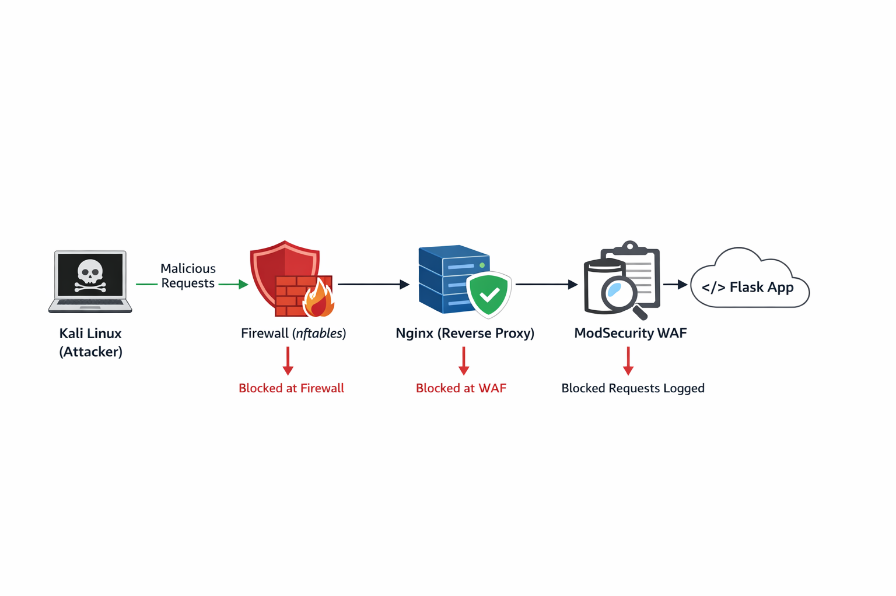
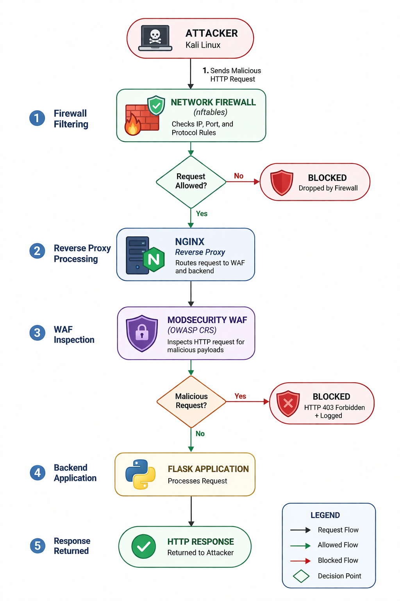

# Layered Web Application Security Architecture

## 📌 Overview
This project demonstrates a **defense-in-depth approach** to securing web applications by implementing multiple security layers in a controlled environment. A deliberately vulnerable Flask-based web application was developed and tested against common web attacks. Security mechanisms were then applied incrementally to evaluate their effectiveness.

---

## 🎯 Objectives
- Simulate real-world web application attacks
- Analyze vulnerabilities in an insecure application
- Implement layered security controls
- Evaluate system behavior before and after protection

---

## 🛠️ Technologies Used

| Category | Tools |
|----------|------|
| Operating Systems | Kali Linux, Ubuntu Server |
| Web Development | Flask, SQLite |
| Network Security | nftables |
| Reverse Proxy | Nginx |
| Web Application Firewall | ModSecurity + OWASP CRS |
| Testing Tools | Burp Suite, curl |
| Scanning | Nmap |

---

## 🧱 System Architecture and Execution Flow

The system follows a **layered security model**:



### Execution Flow


Each layer provides a distinct level of protection, ensuring that malicious traffic is filtered before reaching the application.

---

## 🔍 Attacks Simulated

### 1. SQL Injection
- Authentication bypass
- Boolean-based injection
- UNION-based injection

### 2. Cross-Site Scripting (XSS)
- Script execution via input fields
- Alert-based payload injection

### 3. Path Traversal
- Direct file access
- Directory traversal attacks

---

## ⚙️ Implementation Phases

1. **Baseline Testing (No Security)**
   - All attacks successful
   - Application returned `HTTP 200 OK`

2. **Network Firewall (nftables)**
   - Restricted ports and unauthorized traffic
   - Attacks still successful (no content inspection)
   - Application returned `HTTP 200 OK`

3. **Reverse Proxy (Nginx)**
   - Centralized request routing
   - Backend application hidden from direct access

4. **Web Application Firewall (ModSecurity)**
   - Deep packet inspection using OWASP CRS
   - Attacks blocked with `HTTP 403 Forbidden`

---

## 📊 Results Summary

| Stage | SQLi | XSS | Path Traversal | Response |
|------|------|-----|----------------|----------|
| Baseline | ✅ Successful | ✅ Successful | ✅ Successful | 200 OK |
| Firewall | ✅ Successful | ✅ Successful | ✅ Successful | 200 OK |
| WAF | ❌ Blocked | ❌ Blocked | ❌ Blocked | 403 Forbidden |

---

## 📁 Project Structure

```
layered-web-application-security/
│
├── Configuration_Files/
│   ├── Network_Firewall/
│   ├── Nginx/
│   └── WAF/
│
├── Database/
├── Flask_Application/
├── Logs/
│   ├── modsecurity/
│   └── nginx/
│
├── Payloads/
├── Screenshots/
│   ├── After_implementing_nftables/
│   ├── After_Implementing_WAF/
│   └── Baseline_Attacks/
│
└── README.md
```

---

## 📜 Logs and Monitoring

Sample logs are included to demonstrate detection and blocking:

- **Nginx Access Logs** → Show HTTP 200 → 403 transition  
- **Nginx Error Logs** → Capture request handling issues  
- **ModSecurity Logs** → Show rule-based attack detection  

---

## 🔐 Key Security Insights

- Network firewalls alone cannot prevent application-layer attacks  
- Reverse proxies improve architecture and control traffic flow  
- WAF provides critical protection through deep request inspection  
- Layered security significantly reduces attack success rate  
- Logging is essential for detection, validation, and analysis  

---

## 🚀 Conclusion

This project demonstrates that implementing multiple security layers significantly improves web application security. While the application was fully vulnerable in its initial state, the integration of firewall rules and a Web Application Firewall successfully prevented all tested attacks.

---

## 📚 References
- OWASP Core Rule Set (CRS): https://github.com/coreruleset/coreruleset
- Nginx Documentation: https://nginx.org
- ModSecurity: https://modsecurity.org
- Nmap: https://nmap.org
